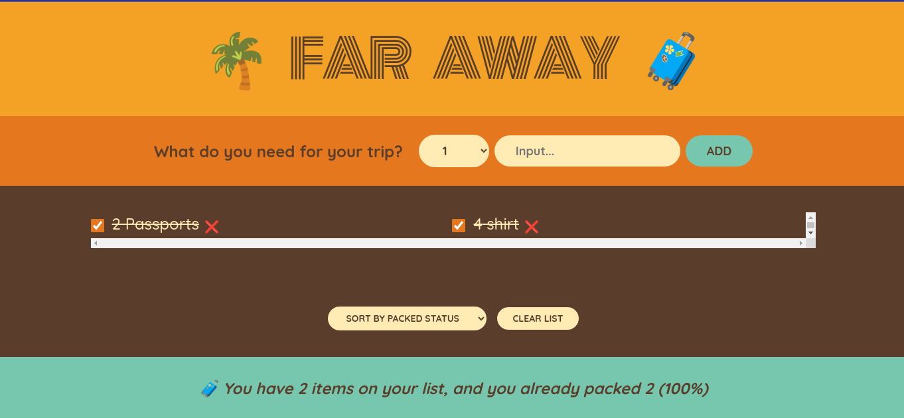

# Far Away (packing list)

Far Away is a simple react app that helps you create and manage your packing list for your next trip. You can add items, mark them as packed, edit them, delete them, and filter them by categories. Far Away is part of the Ultimate React Course by Jonas Schmedtmann.

## Features

- Create items with name, category, quantity, and weight
- Mark items as packed or unpacked
- Edit items by clicking on them
- Delete items by swiping left or right
- Filter items by category (all, clothing, toiletries, electronics, etc.)
- See the total number and weight of items packed and unpacked
- Responsive design that works on different screen sizes

## Installation

To run Far Away locally, you need to have Node.js and npm installed on your machine. Then follow these steps:

- Clone this repository or download the zip file
- Navigate to the project folder and run `npm install` to install the dependencies
- Run `npm start` to start the development server
- Open http://localhost:3000 in your browser to see the app

## License

This project is licensed under the MIT License - see the LICENSE file for details.
